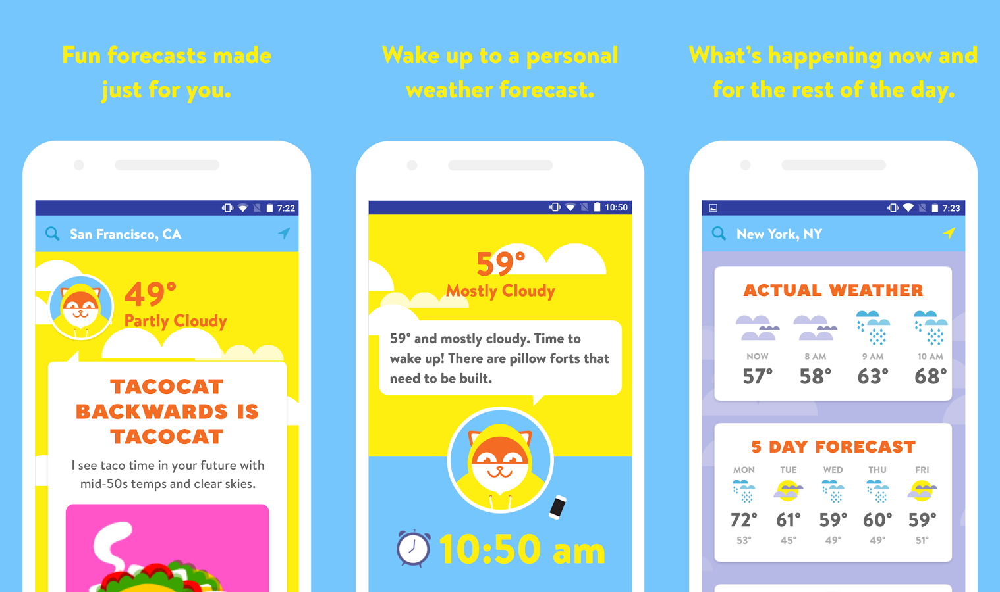

# Poncho
 
As Creative Editor at the weather app and chatbot Poncho, I wrote forecasts, horoscopes, and chatbot messages, and I coded these chatbot messages using RiveScript. Poncho was not just a product but a character, specifically a friendly slacker cat whose voice I honed alongside two other writers. In addition to these writers, I worked closely with designers, developers, and our product manager to create engaging, useful content, and to make the weather more than just small talk. 
---

### Horoscopes

 
### Chatbot messages - Daily weather

 
### Chatbot game - Valentine’s Day MASH

 
---

# Wacha
In addition to writing for the already established Poncho character, when Poncho partnered with the Bravo network, I had the pleasure of taking the lead on a Facebook messenger bot created for the show Watch What Happens Live. I established a unique voice and coded Bravo-related chatbot messages and games for Wacha, Andy Cohen’s (former) pet dog. I'm especially proud of the fetch game, where users could throw a ball for Wacha and he'd bring it unless by chance he got distracted.

